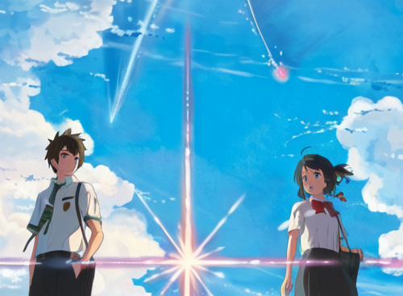

# fine tune models

This repository contains the code for fine-tuning the following models:

1. VQGAN decoder of Craiyon (dalle-mini)
2. VAE decoder of stable-diffusion

--- 
## fine-tuning VQGAN decoder of Craiyon (dalle-mini)

* Training code: [run_finetune_vqgan.py](run_finetune_vqgan.py)
* Demo: [Anim·E](https://github.com/cccntu/anim_e)

| Anim-E              |  Craiyon (formerly DALL-E mini) |
:-------------------------:|:-------------------------:
.png)  |  .png)

* note:
    - If you try to reconstruct an anime-styled image with the VQGAN used by Craiyon (dalle-mini), you can see that the result is not good.
    - So, I fine-tuned the VQGAN decoder of Craiyon (dalle-mini) with the anime images, and the result is much better. See [Anim·E](https://github.com/cccntu/anim_e)

--- 

## fine-tuning VAE decoder of stable-diffusion

* Training code: [run_finetune_vae.py](run_finetune_vae.py)
* Demo: [demo_vae.ipynb](demo_vae.ipynb)

| vae-anime reconstruction              |  vae reconstruction |
:-------------------------:|:-------------------------:
  |  

* note:
    - I fine-tuned at 256x256 resolution, although the VAE in stable-diffusion can handle 512x512 resolution.
    - I did this because the VAE is very good at reconstructing any images I tried, at 512x512 resolution. Excetp I noticed that the VAE sometimes struggles to reconstruct details of an image. Such as a smaller face in a larger image. (see demo notebook  [demo_vae.ipynb](demo_vae.ipynb)). So I think fine-tuning it with images downsampled to 256x256 resolution can help it to reconstruct details better.
    - The result is not as impressive as [Anim·E](https://github.com/cccntu/anim_e). But I think it's because the unet diffusion model of stable-diffusion is not trained to generate anime-styled images. So it still struggle to generate the **latent** of anime-styled images in detail.

## Future work

* fine-tune the unet diffusion model of stable-diffusion

---

## Note: Comparison between VQGAN in dalle-mini and VAE in stable-diffusion

* dalle-mini: restricted to 256x256 resolution
* stable-diffusion: no restriction on resolution
### At 256x256 resolution
* dalle-mini: 256 tokens -> (1x16x16), with vocab size of 16384 (14 bits)
* stable-diffusion: (4x32x32), -> 4096 "tokens" in float (32 bits or 16 bits, depending on the precision)

In conclusion, the vae in stable-diffusion has (4096 * 32) / (256 * 14) >= **36x more information** than the vqgan in dalle-mini to reconstruct the same image at the same resolution.

